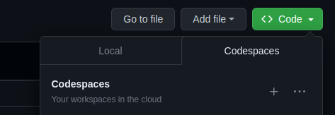

# LabLAD Accounting

Sistema de Accounting do LAD

## Executar no Codespaces
1. Abra a aba de Codespaces no repositório do [LAD Accounting Dashboard](https://github.com/LAD-PUCRS/LAD-Accounting-Dashboard)

2. Você será redirecionado no terminal de um VS Code virtual

3. Coloque o seguinte comando para instalar as bibliotecas necessárias e executar o arquivo lad.py: `./script.sh`

4. Após carregar todo o script, uma conexão será estabelecida no terminal do VS Code virtual; seguido por um pop-up.

    Example: http://127.0.0.1:8050/
 
## Executar na máquina local
1. Antes de começar, copie todo o repositório na máquina local.
2. Abra um terminal e entre no diretório do repositório.
3. Execute o seguinte arquivo para instalar as bibliotecas necessárias pela primeira vez: `./script.sh`
4. Após carregar todo o script, uma conexão será estabelecida no terminal.

    Example: http://127.0.0.1:8050/

### Requisitos:
- [Python 3.7+](https://www.python.org/)
- [Flask](https://flask.palletsprojects.com/en/2.2.x/)
  -  $ pip install Flask
- [Peewee](https://docs.peewee-orm.com/en/latest/peewee/installation.html)
  -  $ pip install peewee

### Outras ferramentas e exemplos:
- [Modelo ER](https://user-images.githubusercontent.com/68079812/182753634-68ca3daf-ed7f-4059-b307-054247fde6da.jpg)
- [Bootstrap](https://getbootstrap.com/docs/5.2/getting-started/introduction/)
- [Dash](https://dash.plotly.com/)
- [Jinja](https://jinja.palletsprojects.com/en/3.1.x/templates/)
- [Exemplo de aplicação com Peewee e Flask](https://docs.peewee-orm.com/en/latest/peewee/example.html)
